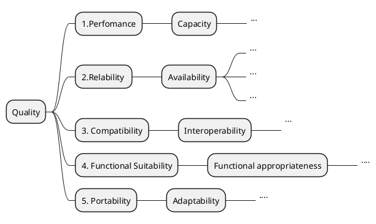

# 

**About arc42**

arc42, the Template for documentation of software and system
architecture.

Created and maintained by Dr. Peter Hruschka, Dr. Gernot Starke and
contributors.

Template Revision: 8.0 EN (based on asciidoc), February 2022

© We acknowledge that this document uses material from the arc 42
architecture template, <https://arc42.org>.

# Introduction and Goals {#section-introduction-and-goals}

## Requirements Overview {#_requirements_overview}

## Quality Goals {#_quality_goals}

## Stakeholders {#_stakeholders}

+-------------+---------------------------+---------------------------+
| Role/Name   | Contact                   | Expectations              |
+=============+===========================+===========================+
| *           | *\<Contact-1\>*           | *\<Expectation-1\>*       |
| \<Role-1\>* |                           |                           |
+-------------+---------------------------+---------------------------+
| *           | *\<Contact-2\>*           | *\<Expectation-2\>*       |
| \<Role-2\>* |                           |                           |
+-------------+---------------------------+---------------------------+

# Architecture Constraints {#section-architecture-constraints}

# System Scope and Context {#section-system-scope-and-context}


## Business Context {#_business_context}

Context Diagram
```plantuml
@startuml
!include https://raw.githubusercontent.com/plantuml-stdlib/C4-PlantUML/master/C4_Context.puml
' uncomment the following line and comment the first to use locally
' !include C4_Context.puml

title System Context diagram for AutoWare Auto and ROS2

Person(Integrator, "Integrator", "Autonomous Vehicle Developer")
System(Autoware_Auto,"Autoware Auto", " Autoware is the world's first all-in-one open-source software for self-driving vehicles hosted under the Autoware Foundation. The Autoware.Auto project, based on ROS 2, is the next generation successor of the Autoware.AI project, based on ROS 1.")


System(Ros2 , "ROS2", "Robot Operating System (ROS) is a set of open source algorithms, hardware driver software and tools developed to develop robot control software. ROS includes mature open source libraries to be used for navigation, control, motion planning, vision and simulation purposes.")

System_Ext(DDS, "DDS", "Data Distribution Service (DDS)  is a data centric publish/subscribe middleware used for data transmission in distributed real time systems. ")

Rel(Integrator, Autoware_Auto, "Utilizes")
Rel_Neighbor(Autoware_Auto, Ros2 , "Based on")

Rel(Ros2 , DDS, "communication middleware")

@enduml
```

**\<optionally: Explanation of external domain interfaces\>**

## Technical Context {#_technical_context}

**\<Diagram or Table\>**

**\<optionally: Explanation of technical interfaces\>**

**\<Mapping Input/Output to Channels\>**

# Solution Strategy {#section-solution-strategy}

# Building Block View {#section-building-block-view}
Container Diagram
```plantuml
@startuml
!include https://raw.githubusercontent.com/plantuml-stdlib/C4-PlantUML/master/C4_Container.puml
' uncomment the following line and comment the first to use locally
' !include C4_Container.puml

' LAYOUT_TOP_DOWN()
' LAYOUT_AS_SKETCH()
LAYOUT_WITH_LEGEND()

title Container diagram for Autoware Auto


 Container(Sensing, "Sensing", "Autoware mainly recognizes road environments with the help of LIDAR scanners and cameras.") 

 Container(Localization, "Localization", "The localization contains nodes and libraries which provide an estimate regarding the location of the vehicle using various methods and algorithms") 
Container(Perception, "Perception",  "filters and segmentation. The filters are nodes and libraries which are part of the filtering pipeline for sensor data. Nodes work as standalone filtering modules or cascaded with other filtering algorithms working on the same sensor data types. Enable sensor data to be grouped into clusters or objects of interest which can provide downstream procsses more information about the environment.") 
Container(Planning, "Planning",  "Produce a trajectory towards a provided goal. Involved in the planning process in order to alleviate the complexity of the path-planning optimization problem.")

Container(Control, "Control", "Nodes and libraries related to the controller functionalities of the vehicle. They enable the autonomous vehicle to follow a reference trajectory appropriately by converting the input trajectory into longitudinal and lateral commands.")
Container(VehicleInterface, "Vehicle Interface", "Sensor/Actuator Drivers")

 
System_Ext(Vehicle, "Vehicle", "The Autonomous Vehicle") 
System_Ext(Sensors, "Sensors", "Lidar, Camera, GPS etc.")

Rel(Sensors, Sensing, "Socket, Serial etc.")
Rel(Sensing, Perception, "Sensing Data")
Rel_Neighbor(Perception, Planning, "Surrounding Environment") 
Rel_Neighbor(Planning, Control, "Trajectory")

Rel(Control, VehicleInterface, "Vehicle Commands")
Rel(VehicleInterface,Control, "Steering, Velocity Feedback")

BiRel(VehicleInterface, Vehicle, "Can, Socket, Serial")

Rel(Sensing, Localization, "Current Position and Velocity") 
Rel(Localization,Perception, "Current Position and velocity") 
Rel(Localization,Planning, "Current Position and velocity") 
Rel(Localization, Control, "Current Position and velocity")
Rel(VehicleInterface, Localization, "VehicleSensor")

@enduml
```


 


## Whitebox Overall System {#_whitebox_overall_system}

***\<Overview Diagram\>***
```plantuml
@startuml
!include https://raw.githubusercontent.com/plantuml-stdlib/C4-PlantUML/master/C4_Component.puml
' uncomment the following line and comment the first to use locally
' !include C4_Component.puml

LAYOUT_WITH_LEGEND()

title Component Diagram for ROS2 based Autoware Auto Application

Component_Ext(DDS, "DDS Middleware library", "DDS Library from DDS vendor")
Container(usercode, "User Code", "C++", "User code for Vehicle Interface, Perception, Planning etc.")

Container_Boundary(app, "ROS2 Components") {
Component(rmw, "RMW", "C++", "ROS middleware Interface")
Component(rcl, "rcl", "C++", "ROS Client Library")
Component(rclCPP, "rclCPP", "C++", "ROS Client Library C++ Wrapper.")
Rel(rmw, DDS, "Uses","Api")
Rel(usercode, rclCPP, "Uses","Api")
Rel(rclCPP, rcl, "Uses","Api")
Rel(rcl, rmw, "Uses","Api")
}

@enduml
```
Motivation

:   *\<text explanation\>*

Contained Building Blocks

:   *\<Description of contained building block (black boxes)\>*

Important Interfaces

:   *\<Description of important interfaces\>*

### \<Name black box 1\> {#__name_black_box_1}

*\<Purpose/Responsibility\>*

*\<Interface(s)\>*

*\<(Optional) Quality/Performance Characteristics\>*

*\<(Optional) Directory/File Location\>*

*\<(Optional) Fulfilled Requirements\>*

*\<(optional) Open Issues/Problems/Risks\>*

### \<Name black box 2\> {#__name_black_box_2}

*\<black box template\>*

### \<Name black box n\> {#__name_black_box_n}

*\<black box template\>*

### \<Name interface 1\> {#__name_interface_1}

...

### \<Name interface m\> {#__name_interface_m}

## Level 2 {#_level_2}

### White Box *\<building block 1\>* {#_white_box_emphasis_building_block_1_emphasis}

*\<white box template\>*

### White Box *\<building block 2\>* {#_white_box_emphasis_building_block_2_emphasis}

*\<white box template\>*

...

### White Box *\<building block m\>* {#_white_box_emphasis_building_block_m_emphasis}

*\<white box template\>*

## Level 3 {#_level_3}

### White Box \<\_building block x.1\_\> {#_white_box_building_block_x_1}

*\<white box template\>*

### White Box \<\_building block x.2\_\> {#_white_box_building_block_x_2}

*\<white box template\>*

### White Box \<\_building block y.1\_\> {#_white_box_building_block_y_1}

*\<white box template\>*

# Runtime View {#section-runtime-view}

## \<Runtime Scenario 1\> {#__runtime_scenario_1}

-   *\<insert runtime diagram or textual description of the scenario\>*

-   *\<insert description of the notable aspects of the interactions
    between the building block instances depicted in this diagram.\>*

## \<Runtime Scenario 2\> {#__runtime_scenario_2}

## ... {#_}

## \<Runtime Scenario n\> {#__runtime_scenario_n}

# Deployment View {#section-deployment-view}

## Infrastructure Level 1 {#_infrastructure_level_1}

***\<Overview Diagram\>***

Motivation

:   *\<explanation in text form\>*

Quality and/or Performance Features

:   *\<explanation in text form\>*

Mapping of Building Blocks to Infrastructure

:   *\<description of the mapping\>*

## Infrastructure Level 2 {#_infrastructure_level_2}

### *\<Infrastructure Element 1\>* {#__emphasis_infrastructure_element_1_emphasis}

*\<diagram + explanation\>*

### *\<Infrastructure Element 2\>* {#__emphasis_infrastructure_element_2_emphasis}

*\<diagram + explanation\>*

...

### *\<Infrastructure Element n\>* {#__emphasis_infrastructure_element_n_emphasis}

*\<diagram + explanation\>*

# Cross-cutting Concepts {#section-concepts}

## *\<Concept 1\>* {#__emphasis_concept_1_emphasis}

*\<explanation\>*

## *\<Concept 2\>* {#__emphasis_concept_2_emphasis}

*\<explanation\>*

...

## *\<Concept n\>* {#__emphasis_concept_n_emphasis}

*\<explanation\>*

# Architecture Decisions {#section-design-decisions}

# Quality Requirements {#section-quality-scenarios}

## Quality Tree {#_quality_tree}


## Quality Scenarios {#_quality_scenarios}

<div style="page-break-after: always"></div>

| Scenario #: Availability      | Scenario Name || |  |  
| :----------- |-----------|-----------|----------- |---------- |
| **Environment:** |  ...  |
|**Stimulus:**|... |
|**Response:**| ...|
|**Response Measure**|... |
|**Architectural Decisions**| **Sensitivity** |**Tradeoff** |**Risks** |**Non-risk**| 
Decision 1 explanation|| Tradeof-1| |
|Decision 2 Explanation|Sensitivitiy-1 | |Risk-1|
|**Reasoning:**| |
|**Sensitivity Tradeoff Risks Non-risk** |**Explanation**|
|Tradeoff_1 |  
|Sensivitiy_1| 
|Risk-1| |


# Risks and Technical Debts {#section-technical-risks}

# Glossary {#section-glossary}

+-----------------------+-----------------------------------------------+
| Term                  | Definition                                    |
+=======================+===============================================+
| *\<Term-1\>*          | *\<definition-1\>*                            |
+-----------------------+-----------------------------------------------+
| *\<Term-2\>*          | *\<definition-2\>*                            |
+-----------------------+-----------------------------------------------+
